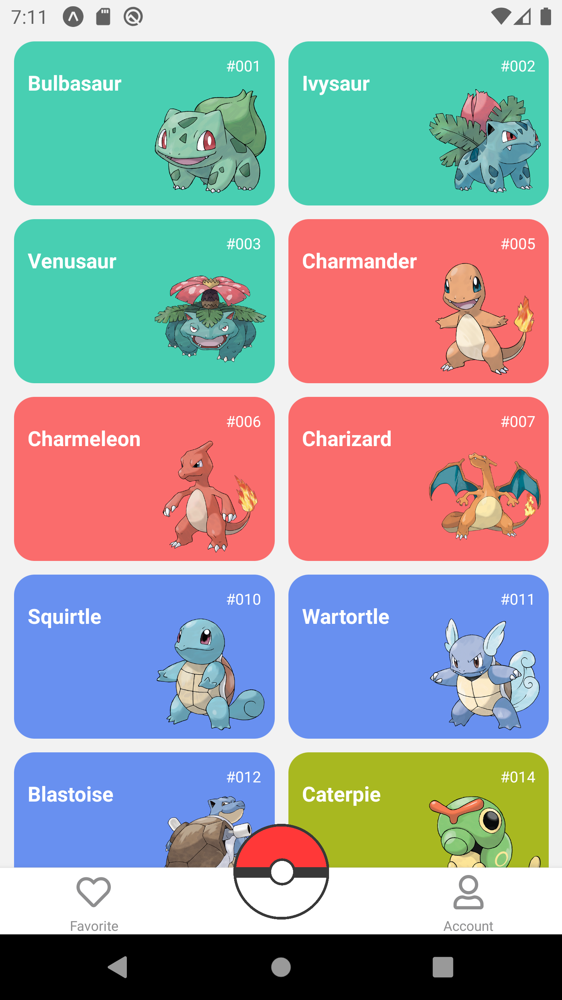

# pokemon-app

A practice making an App using React Native

This is the home of the Pokedex App, A list of all pokemons API.

Here is the "details pokemon" screen on Pokedex App.

Now this is the "favorite screen" of your favorite pokemons.

Finally, this is the Log in screen.

And this is the Log in Screen after you put your information account.

